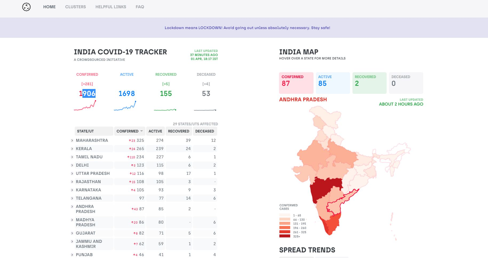

# covid19india
Live at: www.covid19india.org
<p align="center">

</p>

<p align="center">
  View our <a href="https://bit.ly/patientdb">live patient database</a>.
 </p>

## Installation

```bash
$ git clone https://github.com/<yourgithubusername>/covid19india-react
$ cd covid19india-react
$ npm i && npm start

```

## Maintainers

|    [jeremyphilemon](https://github.com/jeremyphilemon)     |
| --- |


## Contribution

If you're new to contributing to Open Source on Github, [this guide](https://guides.github.com/activities/contributing-to-open-source/) can help you get started. Please check out the contribution guide for more details on how issues and pull requests work.

